# Hi, I'm Anatoli Vinokurov! 

## _Israel, Tel-Aviv_

## 🚀 About Me
I'm a full stack developer...

And I'm a android developer...

# My Android Projects

## Rubik's Cube Tutorial 

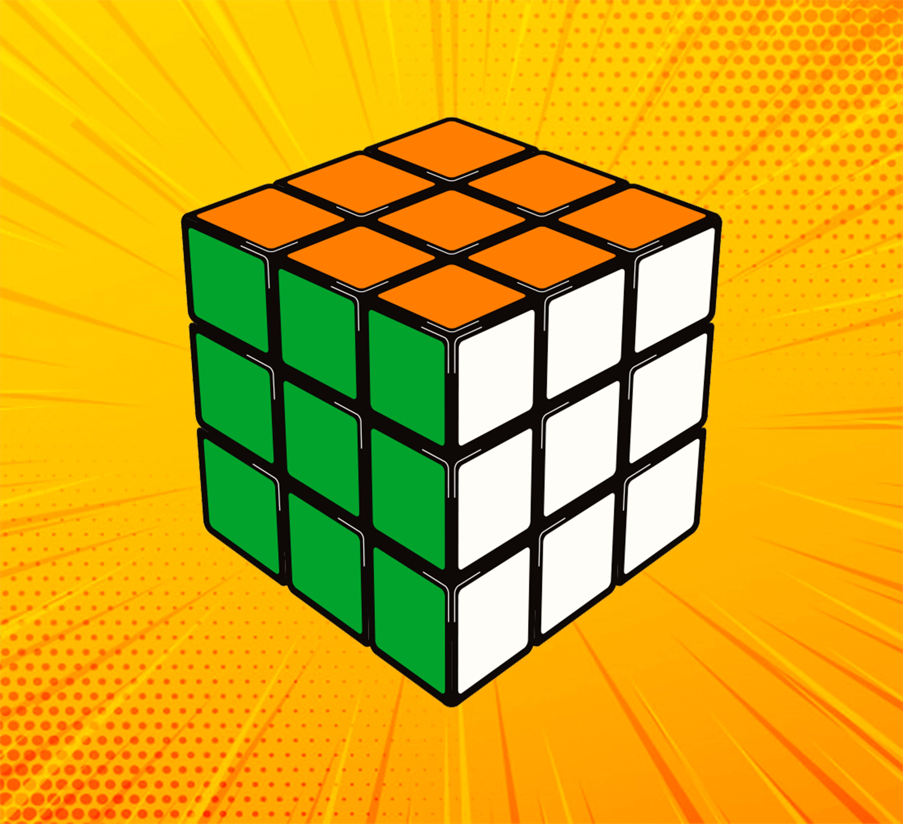 

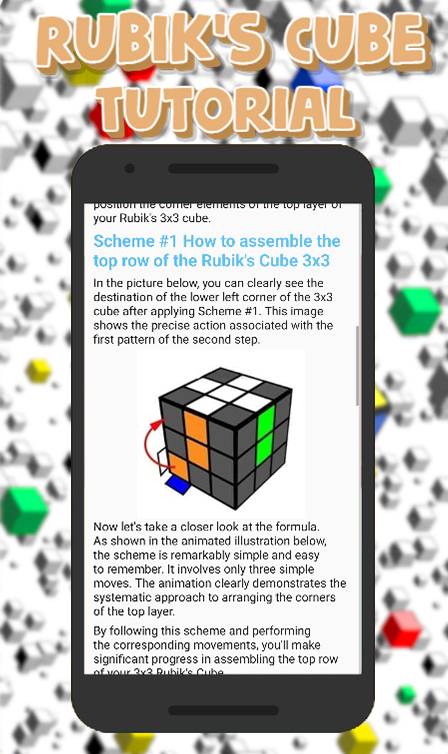 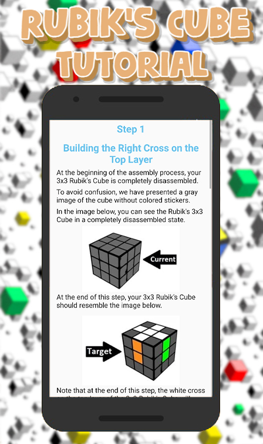 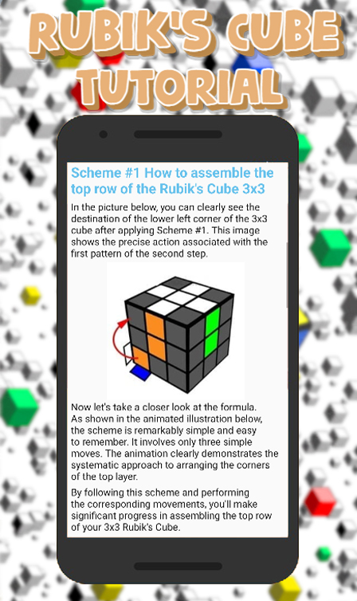

## Skewb Solver - Pocket Guide

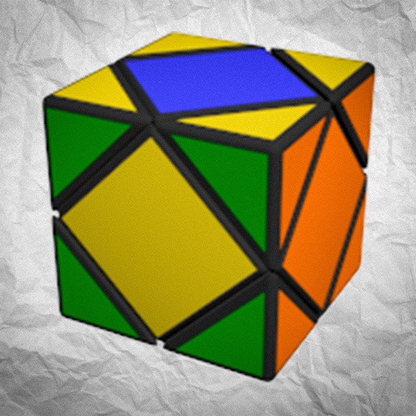 

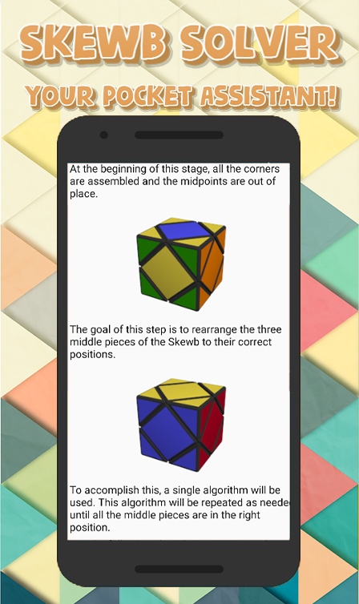 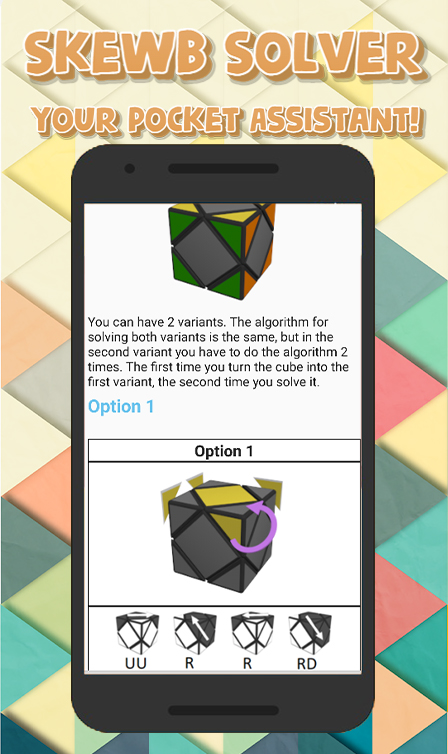 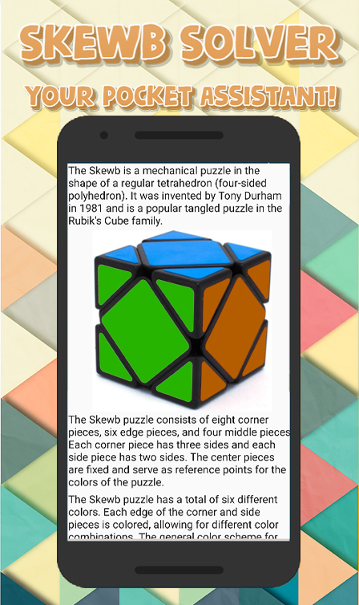

## CubeSolver Pro - CFOP Method

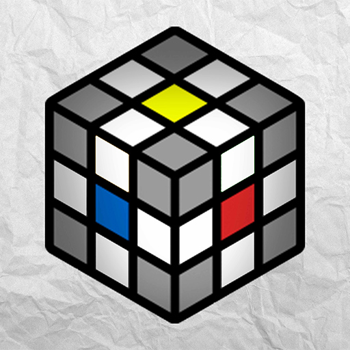 

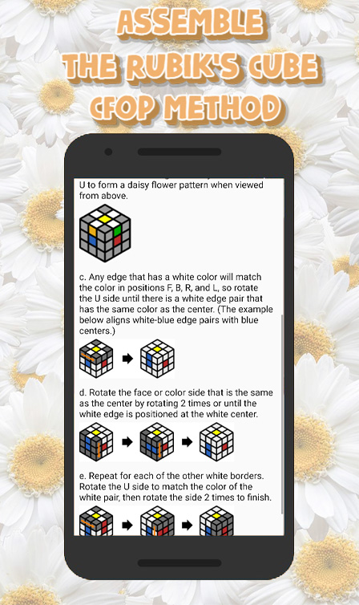 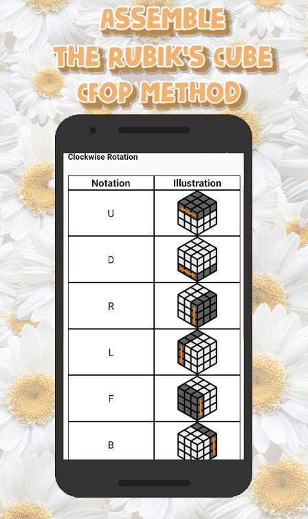 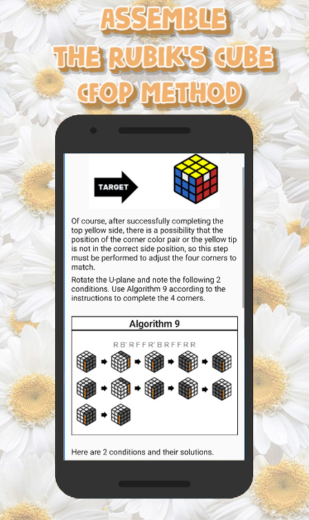

## Flying Toaster

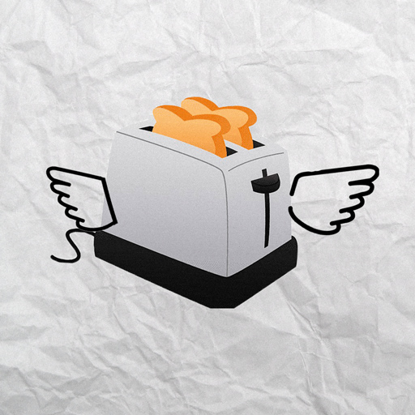 

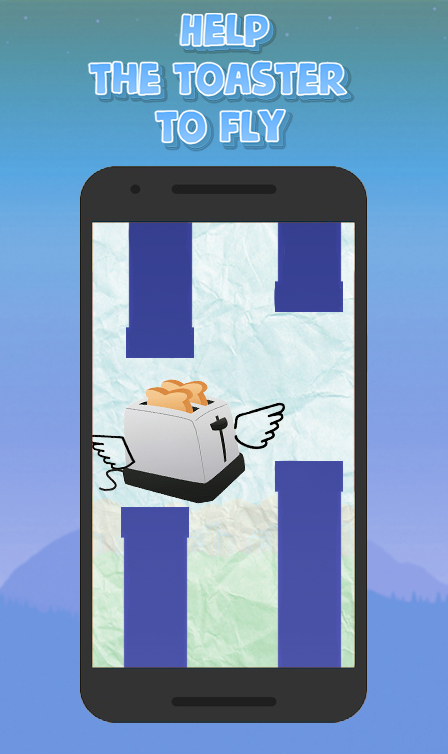 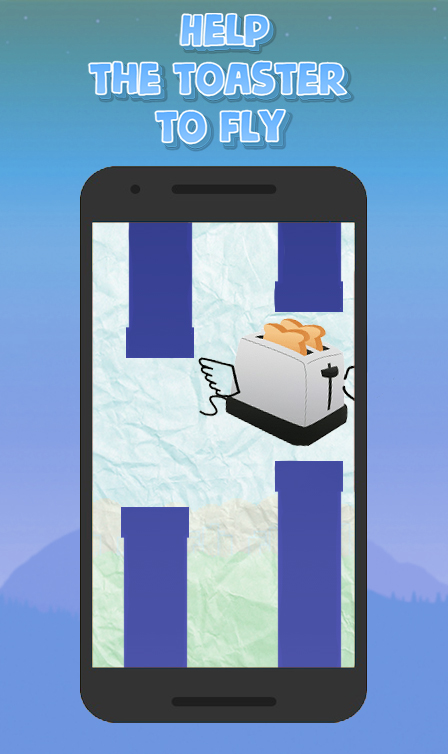 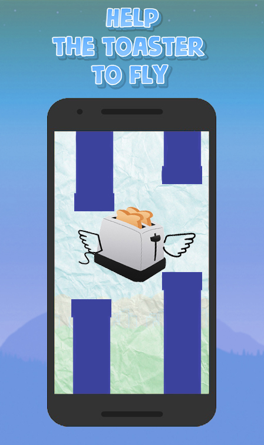

## Yuhd: Chibi Anime Quiz

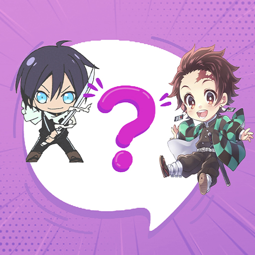 

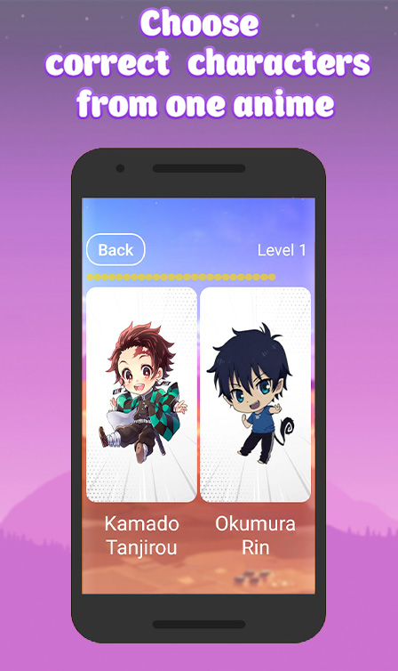 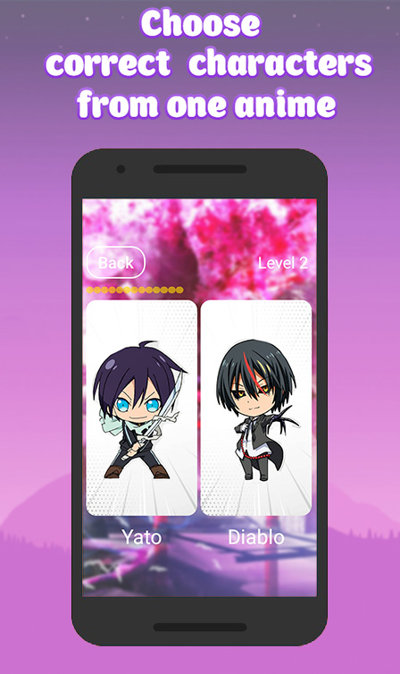 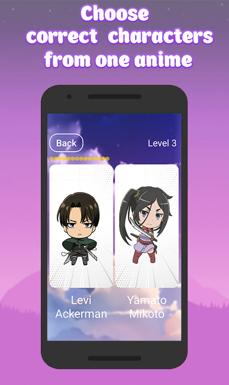

## Zoo Quiz

 

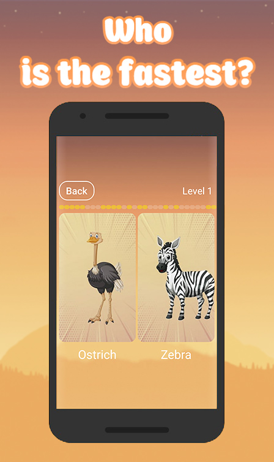 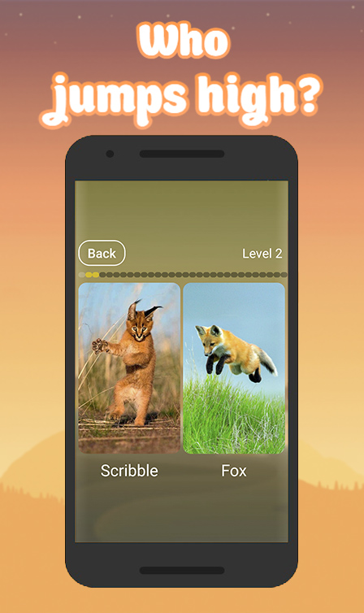 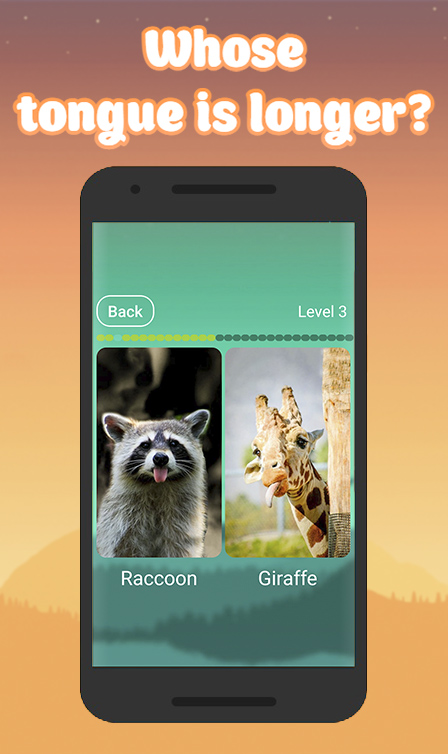

# My Web FullStack Projects

## ReactJS Electronic Shop

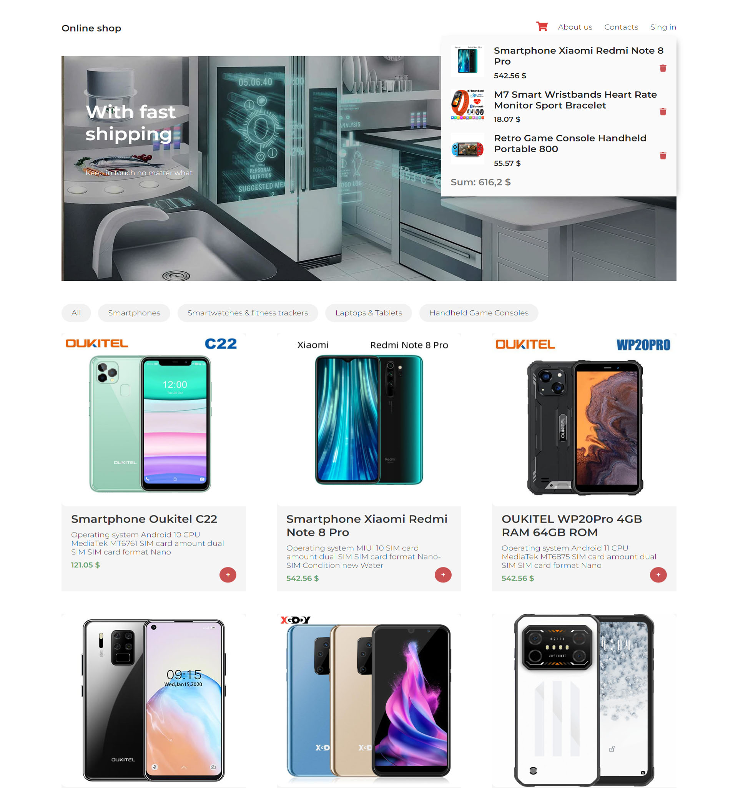 

 